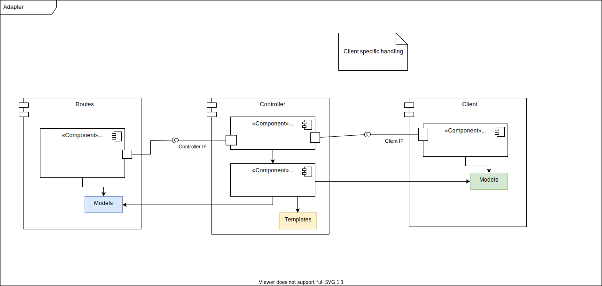

## Getting started
First of all the code has to be generated.
This is done using a OpenAPI v3 specification file which is located at [docs/openapi.yaml](https://github.com/ron96G/fastapi-adapter/blob/main/docs/openapi.yaml).



### Generate the codebase
```bash
poetry install;
poertry run generate_fastapi;
```

### Manual configuration
The idea is that all logic that it adapter specific (e.g. specific workflows) are defined in one or more controller classes that are implemented manually.
The generated code, however, defines a basic interface which the controller class needs to implement:

```python
class Controller:
    async def get_download_media(self, media_id: Any) -> Union[bytes, APIResponse]:
        raise NotImplementedException()

    async def post_send_message(self, body: Any) -> Union[None, APIResponse]:
        raise NotImplementedException()

    async def post_upload_media(self, file: Any) -> APIResponse:
        raise NotImplementedException()
```

An approriate controller class can then be used by replacing the corresponding placeholder in `main.py`:

```python
controller = Controller() # Replace this with the actual controller implementation

configure_routes__downloadMedia_media_id(app, controller)
configure_routes__sendMessage(app, controller)
configure_routes__uploadMedia(app, controller)
```

## Further plans

1. Test further cases like other file uploads, exception handling
2. Add an upstream client SDK which is also generated using an OpenAPI v3 specification (see [openapi-python-client](https://github.com/openapi-generators/openapi-python-client.git))